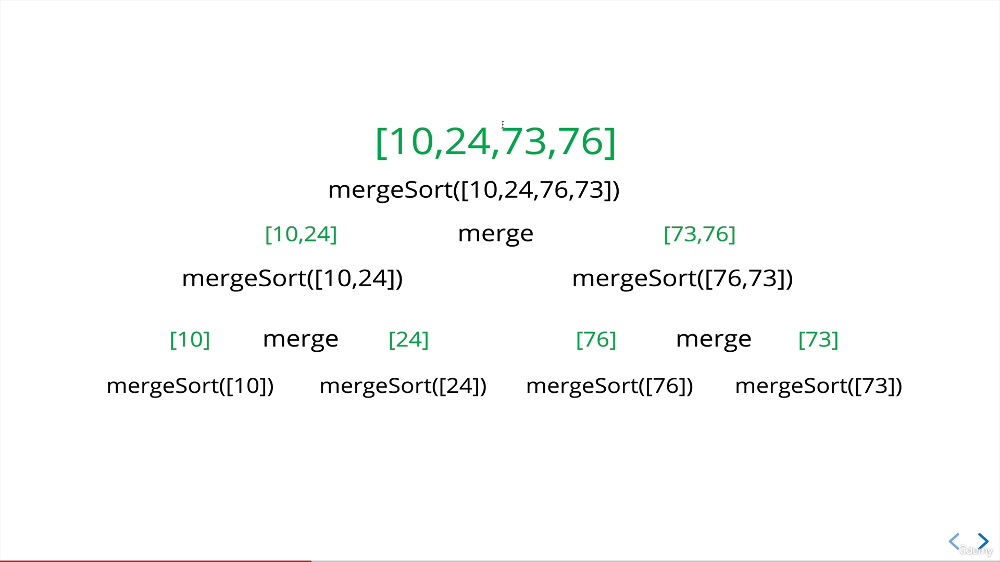

# Merge Sort: Sorting Process

## Overview

Merge Sort is a recursive sorting algorithm that divides an array into smaller halves, sorts each half recursively, and merges the sorted halves using a helper function.

## Prerequisites

Before implementing Merge Sort, ensure you understand recursion. The algorithm heavily relies on recursive function calls to break down and rebuild the array.

## Steps to Implement Merge Sort

1. **Base Case**: If the array has one or zero elements, return the array (already sorted).
2. **Divide**: Find the midpoint and split the array into left and right halves.
3. **Recursive Sorting**: Call Merge Sort recursively on both halves.
4. **Merge**: Merge the sorted halves using the previously implemented `merge` function.

## Code Implementation



```javascript
function mergeSort(array) {
  // Base case: arrays with one or zero elements are already sorted
  if (array.length <= 1) return array;

  // Find the middle index
  const mid = Math.floor(array.length / 2);

  // Recursively sort left and right halves
  const left = mergeSort(array.slice(0, mid));
  const right = mergeSort(array.slice(mid));

  // Merge sorted halves
  return merge(left, right);
}
```

## Explanation of Code

1. **Base Case**:
   - If `array.length <= 1`, return the array as it's already sorted.
2. **Finding the Midpoint**:
   - `mid = Math.floor(array.length / 2)`: Calculates the midpoint.
3. **Recursive Calls**:
   - Calls `mergeSort` on the left and right halves using `slice`.
4. **Merge Step**:
   - Calls `merge(left, right)` to combine sorted subarrays.

## Recursive Call Stack Walkthrough

### Given array:

```javascript
[10, 4, 24, 76, 73, 72, 1];
```

#### Step-by-Step Breakdown

1. **First split:** `[10, 4, 24]` and `[76, 73, 72, 1]`
2. **Further splitting:**
   - `[10, 4]` → `[10]` and `[4]` → Merge → `[4, 10]`
   - `[24]` remains as is.
   - Merge `[4, 10]` and `[24]` → `[4, 10, 24]`
   - Similarly, right half is processed recursively.
3. **Final Merge:**
   - `[4, 10, 24]` and sorted right half are merged into the final sorted array.

## Call Stack Visualization

1. `mergeSort([10, 4, 24, 76, 73, 72, 1])`
2. Calls `mergeSort([10, 4, 24])` → `mergeSort([10, 4])` → `mergeSort([10])`, `mergeSort([4])`
3. Merges `[10]` and `[4]` → `[4, 10]`
4. Merges `[4, 10]` and `[24]` → `[4, 10, 24]`
5. Similar process on right half `[76, 73, 72, 1]`
6. Final merge produces sorted array `[1, 4, 10, 24, 72, 73, 76]`

## Time Complexity Analysis

- **Best Case:** O(n log n)
- **Worst Case:** O(n log n)
- **Average Case:** O(n log n)

## Space Complexity

- **O(n)** due to auxiliary space required for merging.
